# WHS — Software Architecture Documentation

**Project:** WHS — Event-Driven Warehouse Management System

**Course:** Software Architecture and Platforms

---

## Table of Contents

1. [Executive Summary](#1-executive-summary)
2. [Architectural Drivers](#2-architectural-drivers)
3. [Methods For Gathering Architectural Drivers](#3-methods-for-gathering-architectural-drivers)
4. [Architectural Patterns](#4-architectural-patterns)
5. [Component & Connector View](#5-component--connector-view)
6. [Domain Model & Bounded Contexts (DDD)](#6-domain-model--bounded-contexts-ddd)
7. [Tools & Technology Stack](#7-tools--technology-stack)
8. [Event Catalog & API Reference](#8-event-catalog--api-reference)
9. [Event Flows (Behavioral Views)](#9-event-flows-behavioral-views)
10. [Deployment Architecture](#10-deployment-architecture)
11. [Observability](#11-observability)
12. [Testing Strategy](#12-testing-strategy)
13. [Trade-offs & Alternatives Considered](#13-trade-offs--alternatives-considered)
14. [Architectural Decision Records (ADRs)](#14-architectural-decision-records-adrs)
15. [Known Limitations & Future Work](#15-known-limitations--future-work)
16. [Conclusions & Lessons Learned](#16-conclusions--lessons-learned)
17. [Appendix A — Glossary of Domain Events](#appendix-a--glossary-of-domain-events)

---

## 1. Executive Summary

WHS is a simulator of a **Warehouse Management System** (WMS) designed to demonstrate, in a small but realistic codebase, the application of *event-driven microservices* principles to a domain that is naturally event-rich (goods arrival, order placement, picking, shipping). The system is structured as a **monorepo** of nine deployable units running on Node.js 22.22.2:

- **Four core microservices** modelled around bounded contexts: `inventory-service`, `order-service`, `picking-service`, `shipping-service`.
- **Four simulator services** that emulate human operators or external systems by generating workload: `inventory-simulator-service`, `order-simulator-service`, `picking-simulator-service`, `shipping-simulator-service`.
- **One Next.js frontend** acting as a domain dashboard and operator console.

Asynchronous communication is mediated by **Apache Kafka** in **KRaft** mode; each core service owns a private **MongoDB** database and exposes a small **REST** surface. The frontend receives real-time updates through **Server-Sent Events (SSE)** via a Kafka consumer endpoint. Observability is implemented as a log-centric pipeline using **Fluent Bit** and **OpenObserve**, with **Kafka UI** providing topic introspection.

The goal of the report is to make the *architecturally significant* decisions and patterns explicit, justify them against measurable quality attributes, and document the runtime topology in **Component & Connector** notation, the deployment process, the observability stack, and the automated testing strategy.

Headline patterns adopted:

- **Microservices** with strict bounded contexts (database-per-service).
- **Event-Driven Architecture** with **choreography**.
- **Event Sourcing** design: Kafka holds the authoritative event log; MongoDB stores derived read state.
- **CQRS (code-level)** via `@nestjs/cqrs`: CommandBus/QueryBus segregation in every core service, with thin controllers as dispatchers.
- **Backend for Frontend / API Gateway**: Next.js acts as the single entry point for the browser, proxying all `/api/*` requests to backend microservices via server-side rewrites. No microservice URL is exposed to the client, making the system deploy-ready.
- **Real-time push to UI** via Server-Sent Events (SSE) from a Kafka consumer endpoint in the frontend.

---

## 3. Architectural Drivers

Architectural drivers are the *combination* of business goals, quality attributes, and constraints that shape the most consequential design decisions. They are documented here as **Architecturally Significant Requirements (ASRs)** following the *Stimulus / Source / Environment / Response / Response Measure* template typical of the **Quality Attribute Workshop (QAW)** and **ATAM** literature.

### 3.1. Business Goals & Context

The primary business goal is *didactical demonstration*: the architecture must showcase, end to end, the patterns and trade-offs introduced in the course, while remaining small enough to be operated and reasoned about by a single developer on a single machine. Within that umbrella, the following sub-goals are explicit:

- B1. Illustrate **bounded-context decomposition** of a typical WMS domain (inbound, inventory, order, picking, shipping).
- B2. Make the **event flow** visible and inspectable (live UI + Kafka UI + log aggregator).
- B3. Allow a *“god mode”* operator (the user) to exercise both the **happy path** and the **exception flows** (out-of-stock suspension, cancellation, restock-driven resume).
- B4. Provide **runnable simulators** so that the system can be demonstrated without manual interaction.

### 3.2. Quality Attributes (Prioritized)

The following attributes are treated as **drivers**. Performance and security were explicitly *deprioritized* given the academic scope and are discussed as limitations in §15.

| # | Quality Attribute       | Why it is a driver in WHS                                                                                       |
|---|-------------------------|------------------------------------------------------------------------------------------------------------------|
| 1 | **Loose coupling / Modifiability** | Each context must evolve independently; a change to picking logic must not ripple to shipping or inventory. |
| 2 | **Scalability**         | The chosen patterns must allow horizontal scaling per service; back-pressure must be absorbed by the broker.   |
| 3 | **Resilience**          | A single service crash must not stop the system; events must be replayable.                                    |
| 4 | **Testability**         | Every service must be unit- and end-to-end-testable in isolation, with mocked Kafka and MongoDB.               |
| 5 | **Observability**       | Logs from all containers must be centrally inspectable; topic traffic must be visible.                         |
| 6 | **Simulability**        | The system must run end-to-end without human input through the simulator services.                             |
| 7 | **Deployability**       | A single command (`npm run docker:start`) must bring the entire stack up reproducibly.                         |

### 3.3. ASR Scenarios

#### ASR-1 — Modifiability (adding a new event)

| Field             | Value |
|-------------------|-------|
| **Source**        | Developer extending domain logic |
| **Stimulus**      | Need to introduce a new domain event (e.g., `OrderCompleted`) |
| **Environment**   | System at design time, all services running |
| **Response**      | Add the topic to `scripts/init-kafka-topics.sh`; add an `@EventPattern` dispatch in the controller; create a new Command class + CommandHandler in `commands/`; emit via `ClientKafka` in the handler |
| **Response Measure** | Change confined to *one* service's controller dispatch + two new files in `commands/` + *one* line in the topic init script; **no edits to any other service** required |

#### ASR-2 — Scalability (independent horizontal scaling)

| Field             | Value |
|-------------------|-------|
| **Source**        | Operations engineer |
| **Stimulus**      | A spike of `OrderPlaced` events causes inventory checks to lag |
| **Environment**   | Production-like environment |
| **Response**      | Run additional instances of `inventory-service` joining the same `inventory-consumer` group; Kafka partitions distribute load |
| **Response Measure** | Throughput scales sub-linearly with the number of partitions; no other service requires reconfiguration |

#### ASR-3 — Resilience (broker-mediated decoupling)

| Field             | Value |
|-------------------|-------|
| **Source**        | Runtime fault |
| **Stimulus**      | `picking-service` crashes for 60 seconds |
| **Environment**   | Live system |
| **Response**      | Producers continue emitting; on restart, the consumer group resumes from the last committed offset |
| **Response Measure** | Zero events lost; UI eventually consistent within seconds of restart |

#### ASR-4 — Testability

| Field             | Value |
|-------------------|-------|
| **Source**        | CI pipeline / developer |
| **Stimulus**      | Need to validate a service’s logic without provisioning Kafka or MongoDB |
| **Environment**   | Local Jest runner |
| **Response**      | `Test.createTestingModule` with `useValue` overrides for `CommandBus`, `QueryBus`, `ClientKafka`, Mongoose `Model` |
| **Response Measure** | Full per-service unit suite runs under a few seconds, no external dependencies |

#### ASR-5 — Observability

| Field             | Value |
|-------------------|-------|
| **Source**        | Developer debugging an event flow |
| **Stimulus**      | An order is stuck in `SUSPENDED` |
| **Environment**   | All services live |
| **Response**      | Search OpenObserve for `orderId`; cross-check on Kafka UI which topics have/lack messages |
| **Response Measure** | Root cause identified through *log evidence only*, no need to attach a debugger |

#### ASR-6 — Simulability

| Field             | Value |
|-------------------|-------|
| **Source**        | Demonstrator at exam time |
| **Stimulus**      | Need to show end-to-end behavior without manual clicks |
| **Environment**   | Local docker-compose stack |
| **Response**      | Toggle the simulator start controls for inbound, order, picking, and shipping |
| **Response Measure** | Continuous end-to-end traffic flowing through the system within seconds |

#### ASR-7 — Deployability

| Field             | Value |
|-------------------|-------|
| **Source**        | New developer cloning the repo |
| **Stimulus**      | First-time setup |
| **Environment**   | Machine with Node 22 and Docker installed |
| **Response**      | `npm run docker:start` |
| **Response Measure** | Entire stack (Kafka + 4 Mongo + 4 core + 4 simulators + frontend + observability) reaches steady state with no manual fix-ups |

### 3.4. Constraints

- **C1.** Single developer, academic budget → no managed services, no horizontal multi-host setup.
- **C2.** Local-first deployment → Docker Compose, no Kubernetes manifests in scope (though the architecture is designed to be K8s-ready).
- **C3.** Single Kafka broker, replication factor 1 → acceptable for the didactic context, *explicitly insufficient* for production.
- **C4.** No authentication or authorization → out of scope; treated as future work.
- **C5.** Node.js / TypeScript only across backend and frontend → reduces cognitive load for a solo developer.

---

## 4. Methods For Gathering Architectural Drivers

WHS is a **rework** of an earlier project that addressed the WMS domain but with a narrower scope and a different architectural approach: the original system consisted of just two microservices — a **picking service** and a **picking handler** — using message-driven communication. The decision to rebuild the system from scratch was driven by a specific research question: **how do event-driven patterns and a finer microservice granularity impact quality attributes such as performance, availability, loose coupling, and observability** compared to a less decomposed, message-driven design? By expanding the domain to the full warehouse lifecycle (inbound, inventory, orders, picking, shipping) and decomposing it into four bounded-context-aligned services with a durable event log (Kafka) and choreography-based coordination, the rework provides a concrete basis for comparing the two approaches and drawing architectural lessons.

The drivers in §2 emerged from pain points observed in the original project (tight coupling between modules, difficulty testing in isolation, lack of observability).

### 4.1. Prior Project & Real-WMS Domain Study

The first input was the **existing project** itself. The original system covered only the **picking** sub-domain, split across two microservices (picking service and picking handler). While this provided a starting point for understanding message-driven communication between services, the domain scope was too narrow to exercise the full range of architectural patterns targeted by the rework.

The rework therefore **expanded the domain** to the complete warehouse lifecycle. Bounded contexts such as **inbound goods receipt**, **inventory & locations**, **order management**, **wave/picking**, and **dispatch/shipping** were identified through a study of commercial WMS products and academic taxonomies, and mapped onto four core services. The ubiquitous language (see §6) — *order*, *allocation*, *picking task*, *vehicle*, *dispatch*, *location* — was partly inherited from the original project (picking-related terms) and partly introduced during this domain expansion.

Critically, the rework was motivated by a desire to explore the trade-offs of a more granular, event-driven decomposition: the original two-service design concentrated most logic in a small number of components, limiting independent scalability and making it harder to reason about failure boundaries. By expanding to four fine-grained services connected through Kafka event choreography, the new architecture allows a direct comparison of availability (per-service failure isolation), performance (asynchronous vs. coupled processing), modifiability (single-service changes), and observability (centralized event log + log aggregation). These research-oriented goals directly shaped the quality-attribute priorities in §2.2.

### 4.2. Iterative Prototyping (on the Reworked Codebase)

The second input was empirical: starting from the domain knowledge inherited from the original project, each iteration of the *new* codebase exposed quality-attribute issues that were then fed back into the architecture.

- **Iteration 0.** Single-service prototype with in-memory state. Used to validate the new technology stack (NestJS + Kafka + Mongoose) and to extend the domain model beyond the picking scope of the prior project.
- **Iteration 1.** Split into the four core services, expanding from the original two-service picking-only scope to the full warehouse lifecycle. Choreography over Kafka replaced the message-driven approach of the original system. Database-per-service introduced. *Outcome:* validated B1 (bounded contexts) and Q1 (loose coupling).
- **Iteration 2.** Added simulators to drive the system without manual UI clicks. *Outcome:* validated B4/Q6 (simulability).
- **Iteration 3.** Observed a startup race condition where multiple consumers subscribed to topics that did not yet exist, occasionally crashing services with `UNKNOWN_TOPIC_OR_PARTITION`. *Outcome:* introduced the **`kafka-init` initialization container** (see ADR-005).
- **Iteration 4.** Added Fluent Bit + OpenObserve + Kafka UI to satisfy ASR-5 (observability) — a capability entirely absent in the original project.
- **Iteration 5.** Added cancellation flow with `CancelPickingTask` event and idempotent consumers, exposing a real exception path.
- **Iteration 6.** Refactored all core services from a monolithic `AppService` to **CQRS pattern** via `@nestjs/cqrs` (CommandBus + QueryBus), eliminating god-service anti-pattern and enabling per-handler unit testing. *Outcome:* validated Q4 (testability) and Q1 (modifiability — adding a new command is a two-file operation).
- **Iteration 7.** Implemented real-time dashboard updates via **Server-Sent Events (SSE)**. The frontend exposes an `/api/events` endpoint that connects to Kafka as a consumer, streams domain events directly to the browser, and triggers data re-fetches through the `useRealtimeSSE(topics, fetchFn)` React hook. This replaced the original Socket.IO approach, eliminating per-service WebSocket gateways, reducing dependencies, and simplifying connection management on the client. *Outcome:* validated Q5 (observability — live UI reflects Kafka event stream), and ASR-5 (dashboards are immediately consistent with the event log).

This *grounded* the drivers: each ASR in §2 traces back either to a limitation of the original project or to a concrete iteration of the rework that either failed without it or was simplified by it.

### 4.3. ADD-style Decomposition

The third input was an application of **Attribute-Driven Design (ADD)**: starting from the prioritized quality attributes, each architectural decision was justified by the attribute it was meant to satisfy, and the *next* decomposition step was driven by the *next* attribute on the list.

For instance:

- *Loose coupling* drove the choice of **asynchronous messaging over synchronous REST** between services.
- *Scalability* + *resilience* drove the choice of **Kafka over a transient broker** like RabbitMQ in `direct` mode (event log + replay).
- *Testability* drove the choice of **NestJS dependency injection + `@nestjs/cqrs` + `Test.createTestingModule`** patterns over hand-rolled wiring.
- *Observability* drove the choice of **structured stdout logging + a fluentd-driver pipeline** over ad-hoc file logs.
- *Deployability* drove the choice of **Docker Compose + `kafka-init`** over a manual startup script.

---

## 5. Architectural Patterns

This section enumerates the architectural and design patterns actually used in the codebase, with citations to source files. ADRs (§14) discuss the *decision* aspects in more detail; this section focuses on *what* the patterns are and *where* they manifest.

### 5.1. Microservices

Each bounded context is a separately deployable NestJS application with its own `Dockerfile`, `package.json`, and Mongo database.

- inventory-service/, order-service/, picking-service/, shipping-service/ are independent npm workspaces declared at the root package.json.
- Each service has a separate Mongo container in docker-compose.yml: `inventory-db` (27017), `order-db` (27018), `picking-db` (27019), `shipping-db` (27020).
- No service shares a database with any other.

### 5.2. Event-Driven Architecture (EDA) with Choreography

Services do not call each other synchronously over REST. They communicate by *publishing* domain events to Kafka topics and *reacting* to them. There is no central orchestrator: each service decides autonomously what to do when it receives an event.

In NestJS terms, the producer side uses `ClientKafka` inside a `CommandHandler`, while the consumer side uses `@EventPattern(...)` on the controller to dispatch to the `CommandBus`.

### 5.3. Event Sourcing

The system adopts an *event-sourcing* without committing to a full event-sourced data model: **Kafka is the authoritative event log**, MongoDB stores **derived read state** that each service maintains by consuming its events.

In practice, replay is feasible because Kafka retains the events; the schemas in §6 are derivable from event sequences.

### 5.4. CQRS — Code-Level (via `@nestjs/cqrs`)

Every core microservice adopts the **CQRS (Command Query Responsibility Segregation)** pattern *at code level* through the `@nestjs/cqrs` module. Write operations (order placement, Kafka event handling, status updates) are modelled as **Command + CommandHandler** pairs; read operations (data queries for the UI) are modelled as **Query + QueryHandler** pairs.

The controller is a **thin dispatcher**: it does not contain business logic; it merely translates HTTP requests and Kafka messages into command/query objects and dispatches them via the `CommandBus` or `QueryBus`.

Each `CommandHandler` encapsulates the full business logic for a single use-case: Kafka emission and MongoDB writes.

**Important:** both read and write paths share the same MongoDB instance — there is no infrastuctural separation between a write store and a read store. The CQRS is purely a *code-organization* concern that improves testability (handlers can be unit-tested in isolation from the controller) and modifiability (adding a new command does not touch the controller's existing methods).

The canonical file layout per service keeps controllers thin and separates write handlers from read handlers under `commands/` and `queries/`.

### 5.5. Database-per-Service

Each service has a private MongoDB instance with a service-specific connection string injected via `MONGODB_URI`:

The service-specific MongoDB connection string is injected through `MONGODB_URI`.

This guarantees independent schema evolution and enables the simulability driver (a service can be reset by clearing only its own database, see `npm run docker:clean:db`).

### 5.6. Backend for Frontend / API Gateway

The Next.js frontend at `frontend/` acts as both a **BFF** and an **API Gateway**: it aggregates data from the four core services for the operator dashboards, and proxies all API calls to backend microservices via **Next.js rewrites** configured in `next.config.ts`. The backend service URLs are injected as **server-side environment variables** (e.g., `INVENTORY_SERVICE_URL`, `ORDER_SERVICE_URL`), validated at startup with a `requireEnv()` helper — they are never exposed to the browser.

All frontend API calls go through `/api/*` paths (e.g., `/api/inventory/items`), which are rewritten server-side to the actual backend service URLs:

| Browser Path | Backend Destination (server-side) |
|---|---|
| `/api/inventory/:path*` | `INVENTORY_SERVICE_URL/inventory/:path*` |
| `/api/orders/:path*` | `ORDER_SERVICE_URL/orders/:path*` |
| `/api/picking/:path*` | `PICKING_SERVICE_URL/picking/:path*` |
| `/api/shipping/:path*` | `SHIPPING_SERVICE_URL/shipping/:path*` |
| `/api/inbound/:path*` | `INBOUND_SIMULATOR_URL/inbound/:path*` |
| `/api/dispatch/:path*` | `DISPATCH_SIMULATOR_URL/dispatch/:path*` |
| `/api/order-simulator/:path*` | `ORDER_SIMULATOR_URL/order-simulator/:path*` |
| `/api/picking-simulator/:path*` | `PICKING_SIMULATOR_URL/picking-simulator/:path*` |

In addition to rewrites, the frontend exposes two **API route handlers** implemented as Next.js route files:

- `/api/events` — SSE endpoint that connects to Kafka and streams domain events to the browser (see §5.7).
- `/api/status` — Health check aggregator that probes all backend services and infrastructure components, returning a consolidated status report.

This pattern ensures:

- **Deploy-readiness:** Only port 3000 (the frontend) needs to be exposed publicly; all microservice ports remain internal to the Docker network.
- **Security:** No microservice URL is visible to the client browser — a change from the original architecture where `localhost:300x` URLs were hardcoded in the frontend code.
- **Portability:** Switching from local development to production requires only changing the environment variables (e.g., from `http://localhost:3001` to `http://inventory-service:3001` or a Kubernetes Service DNS name).

### 5.7. Real-Time Push via Server-Sent Events (SSE)

The frontend exposes an `/api/events` endpoint that connects to Kafka as a consumer and streams events to the browser via SSE. The `useRealtimeSSE(topics, fetchFn)` hook subscribes to specific Kafka topics and triggers data re-fetches when matching events arrive.

This replaces the previous WebSocket/Socket.IO approach with a simpler, unidirectional SSE stream. It avoids polling and keeps the UI eventually consistent with the read model (cf. §11 on observability).

#### 5.7.1. Real-Time Update Flow (Example: Order Creation)

The following sequence diagram illustrates the complete flow of a real-time order update triggered by the order simulator:

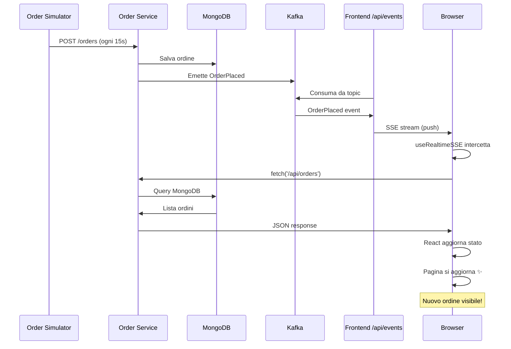

**Key observations:**

- The simulator drives order creation at regular intervals (e.g., every 15 seconds).
- The Order Service persists the order in MongoDB and immediately emits the `OrderPlaced` event to Kafka.
- The frontend's `/api/events` endpoint continuously consumes from Kafka, acting as a bridge between the broker and the browser.
- When an event arrives at the frontend, it is streamed to the browser via **SSE** — a unidirectional, server-push mechanism. No polling is required.
- The `useRealtimeSSE(topics, fetchFn)` hook intercepts the SSE message, verifies that it matches one of the subscribed topics, and triggers `fetchOrders()` to refresh the UI data.
- React detects the state change and re-renders the orders list, making the new order immediately visible to the operator.

This entire flow is **asynchronous and decoupled**: the Order Service does not wait for the UI to acknowledge the event; it simply produces to Kafka and continues. The frontend independently consumes and pushes to the browser. This decoupling is fundamental to the system's resilience and scalability.

### 5.8. Initialization Container Pattern (`kafka-init`)

At startup, a dedicated short-lived container creates all 13 topics with `--if-not-exists` before any service is allowed to start. All core services declare:

All core services depend on `kafka-init` completing successfully before they start.

This eliminates a documented race condition where consumers could subscribe to non-existent topics and crash. See ADR-005 (§14).

### 5.9. Idempotent Consumer (cancellation)

The cancellation flow tolerates duplicate or out-of-order events: `Order Service` checks the current order state before transitioning, and `Picking Service` only cancels a task if it is `PENDING`:

The cancellation logic is idempotent: already-cancelled orders are left untouched, and allocated orders also trigger a picking-task cancellation event.

### 5.10. Simulator / Test-Double Pattern

The four simulator services are not part of the domain — they are *active test doubles* that exercise the real services in real environments. Each is a thin NestJS app that drives the core services exclusively over their public REST APIs, without interacting with Kafka directly. This satisfies the *simulability* driver without polluting the production code paths.

### 5.11. Health Check Endpoint Convention

Every core service exposes a health check that returns `{ status: 'ok', service: '<name>' }`. This is used both by humans and as an e2e smoke test (see §12).

---

## 6. Component & Connector View

The **Component & Connector (C&C)** viewtype models the runtime structure of the system as a graph of *components* (units with runtime presence) connected by *connectors* (typed interaction mechanisms). It is the most relevant view for an event-driven system because it makes the asynchronous traffic explicit.

### 6.1. Component Catalog

| Component (Container)             | Type                | Port (host) | Role                                                                    |
|-----------------------------------|---------------------|-------------|-------------------------------------------------------------------------|
| `frontend`                        | Next.js app         | 3000        | Operator dashboards / API Gateway / BFF                                                       |
| `inventory-service`               | NestJS microservice | 3001        | Inventory + reservations + inbound goods                                |
| `order-service`                   | NestJS microservice | 3002        | Order lifecycle and allocation orchestration (per-order)                |
| `picking-service`                 | NestJS microservice | 3003        | Picking task lifecycle                                                  |
| `shipping-service`                | NestJS microservice | 3004        | Vehicle assignment and dispatch                                         |
| `inventory-simulator-service`     | NestJS service      | 3005        | Triggers inbound goods receipt                                          |
| `shipping-simulator-service`      | NestJS service      | 3006        | Auto-dispatches loaded vehicles via REST                                |
| `order-simulator-service`         | NestJS service      | 3007        | Auto-creates and randomly cancels orders via REST                       |
| `picking-simulator-service`       | NestJS service      | 3008        | Auto-completes picking tasks via REST                                   |
| `kafka` (KRaft)                   | Apache Kafka        | 9092 / 29092 | Durable event log / message broker                                     |
| `kafka-init`                      | One-shot init       | —           | Pre-creates all 13 topics                                               |
| `kafka-ui`                        | Provectus Kafka UI  | 8090        | Topic introspection (read-only)                                         |
| `inventory-db`                    | MongoDB             | 27017       | Read store for inventory                                                |
| `order-db`                        | MongoDB             | 27018       | Read store for orders                                                   |
| `picking-db`                      | MongoDB             | 27019       | Read store for picking tasks                                            |
| `shipping-db`                     | MongoDB             | 27020       | Read store for vehicles + pending shipments                             |
| `fluent-bit`                      | Log shipper         | 24224 (in)  | Receives container logs over fluentd protocol, filters, forwards        |
| `openobserve`                     | Log/observability   | 5080        | Stores and queries aggregated logs                                      |

### 6.2. Connector Catalog

| Connector type                  | Direction                                    | Wire protocol           |
|---------------------------------|----------------------------------------------|-------------------------|
| **Kafka pub/sub**               | Producer → Topic → Consumer                  | Kafka binary, port 9092 |
| **HTTP (browser → frontend)**   | Browser → Frontend (API Gateway)             | HTTP/JSON on port 3000  |
| **REST proxy (frontend → backend)** | Frontend rewrites → Core / Simulator Services | HTTP/JSON (server-side, Docker-internal) |
| **REST (simulator → service)**  | Simulator → Core Service                     | HTTP/JSON (Docker-internal) |
| **SSE**                         | Frontend `/api/events` → Browser             | Server-Sent Events over HTTP |
| **Mongo wire protocol**         | Service → its own DB                         | TCP 27017 (per container) |
| **Fluentd forward**             | Container stdout → fluent-bit                | Fluentd on TCP 24224    |
| **HTTP JSON ingest**            | fluent-bit → openobserve                     | HTTP POST `/api/.../whs_logs/_json` |
| **Kafka admin TCP**             | kafka-ui → kafka                             | Kafka admin protocol    |

### 6.3. C&C Diagram

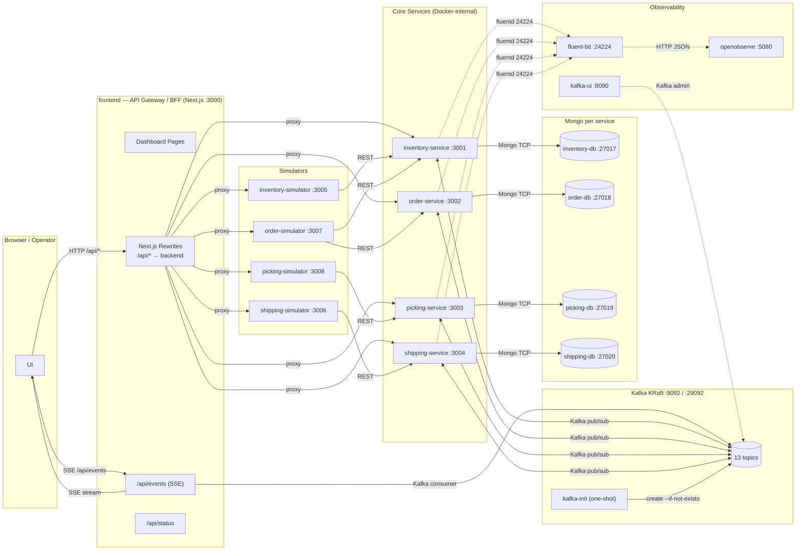

### 6.4. Per-Component Detail

#### 6.4.1. `frontend` (API Gateway / BFF)

- **Role:** single public entry point (API Gateway) for the browser. Serves operator dashboards (Orders, Inventory, Picking, Shipping, Status, Inbound) and proxies all `/api/*` requests to the corresponding backend services via Next.js rewrites. Also exposes `/api/events` (SSE) and `/api/status` (health aggregator) as Next.js API route handlers.
- **Inbound connectors:** HTTP from the browser on port 3000 — the *only* port exposed externally.
- **Outbound connectors:** REST proxy to the four core services and four simulators (via server-side rewrites using environment variables); Kafka consumer for the SSE endpoint; SSE stream back to the browser.
- **API Gateway semantics:** backend service URLs (`INVENTORY_SERVICE_URL`, `ORDER_SERVICE_URL`, etc.) are injected as server-side environment variables and validated at startup with `requireEnv()`. They are *never* sent to the client. This decouples the deployment topology from the frontend code: the same Next.js build works against `localhost:300x` (development), Docker service names (compose), and Kubernetes DNS names (production).
- **Dependencies:** declared in docker-compose.yml — `frontend` waits for Kafka, `kafka-init`, and all core/simulator services before starting (only for orderly UX bootstrap; the UI can technically render without backends).

#### 6.4.2. `inventory-service`

- **Schema:** a single `Inventory` aggregate keyed by `(productId, location)` with `quantity` and `reservedQuantity` (inventory.schema.ts).
- **Consumed events:** `OrderPlaced`, `OrderCancelled`.
- **Produced events:** `ItemStored`, `InventoryAllocated`, `OutOfStock`.
- **Behavior:** owns stock levels and reservation logic. On `OrderPlaced`, the `HandleOrderPlacedHandler` iterates the requested items and attempts to reserve sufficient quantity at a matching location; if all items are satisfiable it emits `InventoryAllocated` (carrying the resolved allocations), otherwise it emits `OutOfStock`. When goods arrive from the simulator, the `ReceiveGoodsHandler` increments the stored quantity at the specified location and emits `ItemStored`, which in turn allows the Order Service to retry suspended orders. On `OrderCancelled`, the `HandleOrderCancelledHandler` releases the reserved quantities recorded in the event's `allocations` payload and emits `ItemStored` to signal that stock is again available.

#### 6.4.3. `order-service`

- **Schema:** `Order` aggregate with `orderId`, `items[]`, `status`, `allocations[]` (order.schema.ts). Status enum: `PENDING | SUSPENDED | ALLOCATED | PICKING_COMPLETED | SHIPPED | CANCELLED`.
- **Consumed:** `InventoryAllocated`, `OutOfStock`, `ItemStored`, `PickingTaskCompleted`, `ShipmentAssigned`.
- **Produced:** `OrderPlaced`, `OrderCancelled`, `OrderReadyForPicking`, `OrderSuspended`, `CancelPickingTask`.
- **Behavior:** owns the per-order state machine. When a new order is placed, the `PlaceOrderHandler` persists the order as `PENDING` and emits `OrderPlaced` to trigger inventory allocation. On `InventoryAllocated`, the `HandleInventoryAllocatedHandler` transitions to `ALLOCATED` and emits `OrderReadyForPicking`; on `OutOfStock`, the `HandleOutOfStockHandler` transitions to `SUSPENDED` and emits `OrderSuspended`. On `ItemStored`, the `HandleItemStoredHandler` scans for suspended orders matching the restocked product and re-emits `OrderPlaced` for each (the **restock flow**). On `PickingTaskCompleted`, transitions to `PICKING_COMPLETED`; on `ShipmentAssigned`, transitions to `SHIPPED`. Cancellation transitions any cancellable order to `CANCELLED`, conditionally emits `CancelPickingTask` (if previously `ALLOCATED`), and always emits `OrderCancelled` carrying `previousStatus` and `allocations` so Inventory can release reserved stock.

#### 6.4.4. `picking-service`

- **Schema:** `PickingTask` aggregate with `taskId`, `orderId`, `allocations[]`, `status` ∈ `{PENDING, IN_PROGRESS, COMPLETED, CANCELLED}` (picking.schema.ts).
- **Consumed:** `OrderReadyForPicking`, `CancelPickingTask`.
- **Produced:** `PickingTaskCreated`, `PickingTaskCompleted`.
- **Behavior:** owns the picking task lifecycle. On `OrderReadyForPicking`, the `HandleOrderReadyForPickingHandler` creates a `PickingTask` in `PENDING` state and emits `PickingTaskCreated`. When a worker or simulator marks the task complete, the `CompletePickingTaskHandler` transitions the task to `COMPLETED` and emits `PickingTaskCompleted`. On `CancelPickingTask`, the `HandleCancelPickingTaskHandler` cancels the task only if still `PENDING` (idempotent guard).

#### 6.4.5. `shipping-service`

- **Schemas:** `Vehicle` aggregate (`vehicleId`, `maxCapacity`, `currentLoad`, `assignedTaskIds[]`, `status` ∈ `{AVAILABLE, DISPATCHED}`) and `PendingShipment` aggregate (vehicle.schema.ts, pending-shipment.schema.ts).
- **Consumed:** `PickingTaskCompleted`.
- **Produced:** `VehicleRegistered`, `ShipmentAssigned`, `VehicleDispatched`.
- **Behavior:** owns the vehicle lifecycle and outbound shipment assignment. On `PickingTaskCompleted`, the `HandlePickingTaskCompletedHandler` attempts to assign the task to an available vehicle with spare capacity and emits `ShipmentAssigned`; if no suitable vehicle exists, the task is persisted as a `PendingShipment` and will be assigned once a vehicle with sufficient capacity is registered. When an operator or simulator dispatches a vehicle, the `DispatchVehicleHandler` transitions it to `DISPATCHED` and emits `VehicleDispatched`.

#### 6.4.6. Simulators

| Simulator                       | Drives                                            | Mechanism                  |
|---------------------------------|---------------------------------------------------|----------------------------|
| `inventory-simulator-service`   | inbound goods receipt                              | REST → inventory           |
| `order-simulator-service`       | order placement + random cancellation             | REST → order/inventory     |
| `picking-simulator-service`     | task completion                                    | REST → picking             |
| `shipping-simulator-service`    | vehicle dispatch                                   | REST → shipping            |

Each simulator exposes start/stop/status controls for runtime control.

---

## 7. Domain Model & Bounded Contexts (DDD)

The system uses **Domain-Driven Design (DDD)** applied at the level of *strategic design*: the four core services correspond to four **bounded contexts**, each with its own ubiquitous language and aggregates. *Tactical* DDD constructs (rich aggregates, value objects, domain services) are intentionally kept lightweight given the academic scope.

### 7.1. Bounded Contexts

| Bounded Context | Aggregate(s)                       | Owns                                                                 |
|-----------------|------------------------------------|----------------------------------------------------------------------|
| Inventory       | `Inventory`                        | Stock per (productId, location), reservations, inbound receipts      |
| Order           | `Order`                            | Order lifecycle, items, captured allocations                         |
| Picking         | `PickingTask`                      | Picking tasks generated from allocated orders                        |
| Shipping        | `Vehicle`, `PendingShipment`       | Vehicles, capacity, dispatch state, queue of pending shipments       |

### 7.2. Ubiquitous Language

| Term              | Meaning in WHS                                                       | Source                                  |
|-------------------|-----------------------------------------------------------------------|-----------------------------------------|
| **Allocation**    | A reservation of stock at a specific location for a specific order   | `Inventory.reservedQuantity`, `Order.allocations` |
| **Picking task**  | A list of items to be physically retrieved from a location           | `PickingTask`                           |
| **Pending shipment** | A completed picking task awaiting vehicle assignment              | `PendingShipment`                       |
| **Dispatch**      | The act of sending a loaded vehicle out of the warehouse             | `Vehicle.status = DISPATCHED`           |
| **Inbound**       | Goods arriving from a supplier, to be stored                         | Inbound receipt flow                    |
| **Restock**       | Stock arrival that *unblocks* previously suspended orders            | `ItemStored` triggering retry           |

### 7.3. Order State Machine

The most complex domain object is the `Order`. Its lifecycle is implemented across the command handlers in order-service/src/commands/ and validated by tests in order-service/test/.

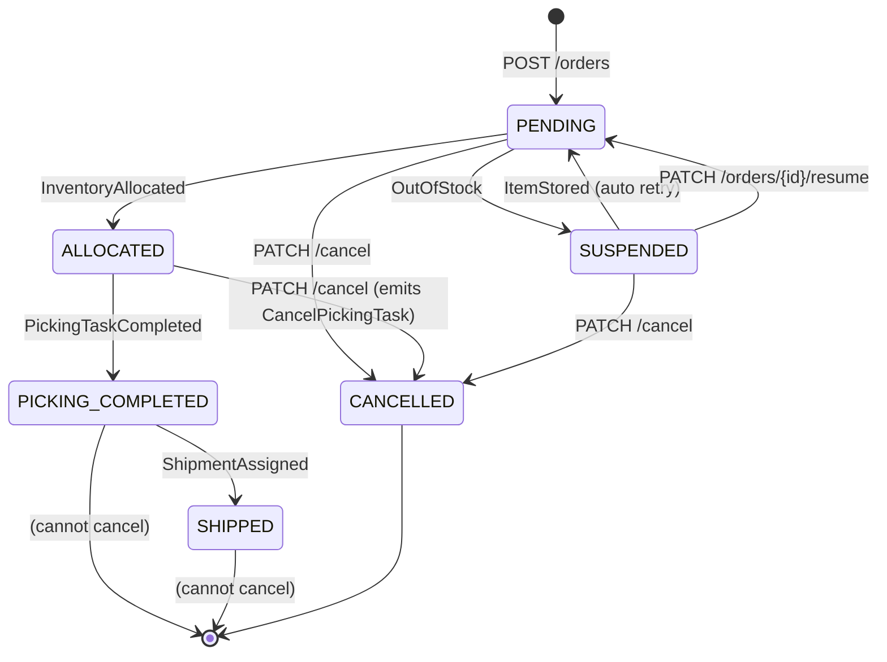

Two transitions are *forbidden* and are enforced as preconditions in the `CancelOrderHandler`: shipped orders cannot be cancelled, and orders with completed picking tasks are also rejected.

### 7.4. Picking Task State Machine

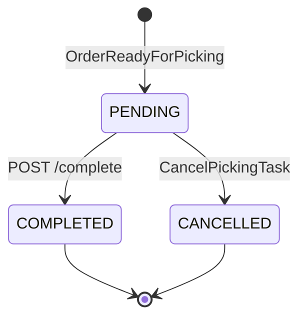

`IN_PROGRESS` is reserved in the schema for future operator hand-off mid-task but is currently unused.

### 7.5. Vehicle State Machine

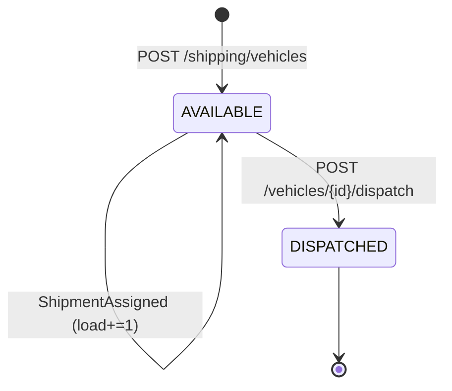

### 7.6. Anti-Corruption Layer

The simulators play the role of an **Anti-Corruption Layer (ACL)** for the artificial workload generation: instead of polluting the core services with “demo data” seeders, simulators sit *outside* the bounded contexts and drive them through their public API REST endpoints. This preserves the integrity of the domain model.

Beyond artificial workload generation, the simulator architecture also enables **legacy data migration**: simulators can be extended to consume data from a legacy warehouse system, transform it according to the WHS ubiquitous language, and replay it into the new services via the same public REST endpoints. This approach decouples migration logic from the core domain model and allows both systems to coexist during the transition period without requiring direct database links or cross-service transactions.

---

## 8. Tools & Technology Stack

The stack is intentionally minimal and optimized for local, end-to-end demonstrations.

| Area | Main choices |
|------|--------------|
| **Runtime & language** | Node.js **22.22.2 LTS** + TypeScript **5.7.3** (pinned via `engines`) |
| **Backend** | NestJS **11.x** (`@nestjs/core`, `@nestjs/microservices`, `@nestjs/cqrs`, `@nestjs/mongoose`) + `kafkajs` **2.2.x** + `mongoose` **9.2.x** |
| **Frontend** | Next.js **16.1.6**, React **19.2.x**, Tailwind **4.x**, `framer-motion` **12.x** |
| **Messaging** | Apache Kafka (KRaft), listeners on `9092` (Docker) / `29092` (host), single-broker didactic topology |
| **Persistence** | MongoDB per service (`inventory`, `order`, `picking`, `shipping`) on ports `27017–27020` |
| **Testing & quality** | Jest 30 + ts-jest 29, supertest 7, ESLint 9, Prettier 3 |
| **Build & packaging** | `nest build` (backend), `next build` (frontend), npm workspaces |
| **Infra & deployment** | Docker + Docker Compose, `kafka-init` topic bootstrap via `scripts/init-kafka-topics.sh` |
| **Observability** | Fluent Bit + OpenObserve + Kafka UI, Docker `fluentd` logging driver |

**Rationale (short):** NestJS + CQRS keeps services modular and testable; Kafka provides a durable event backbone; MongoDB fits document-shaped aggregates; Fluent Bit/OpenObserve centralizes logs with low operational overhead.

---

## 9. Event Catalog & API Reference

### 9.1. Topic Catalog

The 13 topics are pre-created at startup by the `kafka-init` container, which executes `scripts/init-kafka-topics.sh`. Each topic has 1 partition and replication factor 1.

| Topic                      | Producer(s)              | Consumer(s)              |
|----------------------------|--------------------------|--------------------------|
| `OrderPlaced`              | order-service            | inventory-service        |
| `OrderCancelled`           | order-service            | inventory-service        |
| `OrderReadyForPicking`     | order-service            | picking-service          |
| `OrderSuspended`           | order-service            | frontend                 |
| `CancelPickingTask`        | order-service            | picking-service          |
| `InventoryAllocated`       | inventory-service        | order-service            |
| `OutOfStock`               | inventory-service        | order-service            |
| `ItemStored`               | inventory-service        | order-service            |
| `PickingTaskCreated`       | picking-service          | frontend                 |
| `PickingTaskCompleted`     | picking-service          | order-service, shipping-service |
| `ShipmentAssigned`         | shipping-service         | order-service            |
| `VehicleDispatched`        | shipping-service         | frontend                 |
| `VehicleRegistered`        | shipping-service         | frontend                 |

### 9.2. Producer/Consumer Map (reused diagram)

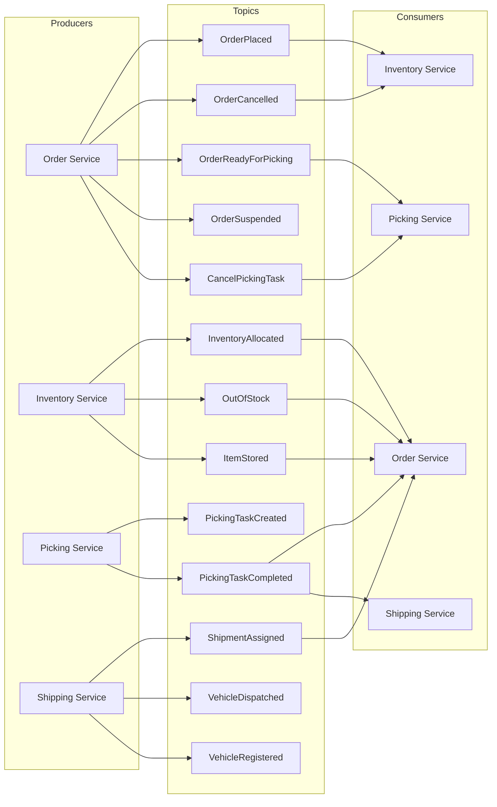

---

## 10. Event Flows (Behavioral Views)

The three flows below are the demonstration scenarios for the system.

### 10.1. Happy Path


### 10.2. Cancellation Flow

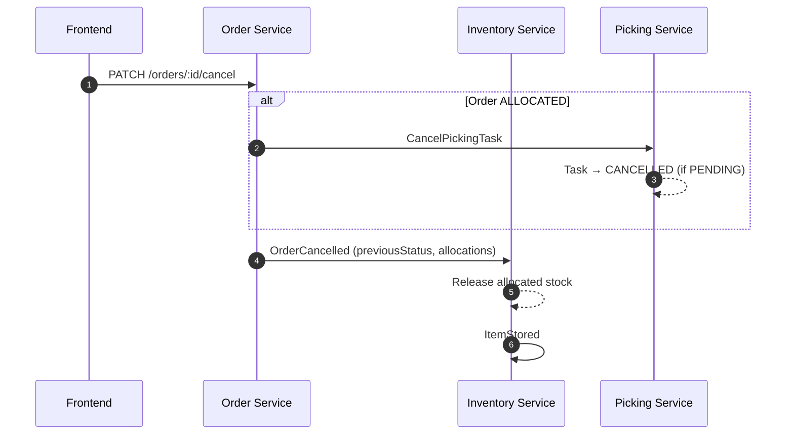

Two design points are worth highlighting:

1. **The cancellation is initiated synchronously** (HTTP `PATCH`) but its consequences (releasing stock, cancelling the picking task) are propagated **asynchronously** via Kafka. This is a deliberate inversion of control to keep services decoupled.
2. **`OrderCancelled` carries `previousStatus` and `allocations`**. This is necessary because Inventory must know *which* allocations to release, even though the order has already transitioned to `CANCELLED`.

### 10.3. Restock-Driven Resume


This is the system’s **eventual consistency** showcase: the Order Service does not poll Inventory; it simply reacts to `ItemStored` and re-emits `OrderPlaced` for any order it had previously suspended.

---

## 11. Deployment Architecture

The deployment process is realized entirely via **Docker Compose**, defined in the single docker-compose.yml file at the repository root and driven by npm scripts in the root package.json.

### 11.1. Build Process

Each service has its own `Dockerfile` and follows the same simple build pattern: install dependencies, copy the source, build the app, and start the production entrypoint. All Dockerfiles are intentionally single-stage; multi-stage builds are listed in §15 as future work.

### 11.2. Orchestration: `docker-compose.yml`

The compose file defines:

- **Infrastructure containers:** `kafka`, `kafka-init`, `kafka-ui`, `openobserve`, `fluent-bit`, plus four `mongo:latest` instances.
- **Application containers:** four core services, four simulators, and the frontend.
- **Volumes:** four named volumes for Mongo persistence (`inventory_mongodb_data`, …) and one for OpenObserve (`openobserve_data`).
- **Service-to-service environment wiring:** every NestJS service receives `KAFKA_BROKER=kafka:9092`; simulators receive HTTP URLs of the services they drive; the frontend receives server-side environment variables for every backend service (`INVENTORY_SERVICE_URL=http://inventory-service:3001`, etc.) used by the Next.js rewrites to proxy `/api/*` requests — these URLs are never exposed to the browser.

### 11.3. Startup Dependency Chain

The startup order is enforced by `depends_on` with `condition`. Two condition types are used:

- `service_healthy` — for Kafka (driven by a `healthcheck` running `kafka-broker-api-versions.sh`).
- `service_completed_successfully` — for `kafka-init` (a one-shot container that exits 0 when topics are created).

### 11.4. CI/CD Pipeline (GitHub Actions)

The CI/CD pipeline is fully implemented on **GitHub Actions** (`.github/workflows/deploy.yml`) and is triggered on every `push` to the repository. The workflow is designed as a two-stage process using job matrices to parallelize operations across all microservices and simulators:

1. **`run-tests` Matrix**: Executes the automated testing suite (`npm run test`) for each backend service independently (e.g., *inventory-service*, *order-service*, *picking-simulator-service*, etc.). This stage ensures that no breaking changes are introduced.
2. **`build-and-push` Matrix**: Depends on the successful completion of the `run-tests` stage. It builds the Docker images for the frontend, all core microservices, and simulators, and pushes them to the container registry.

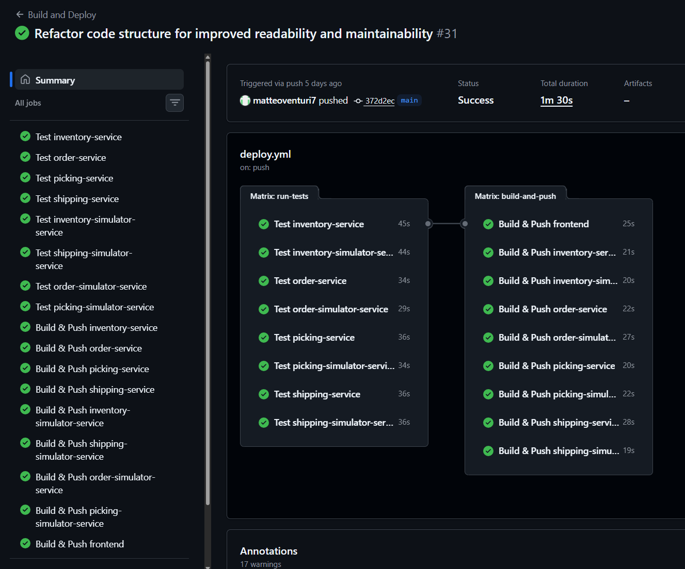

The deployment dependency graph is shown below :

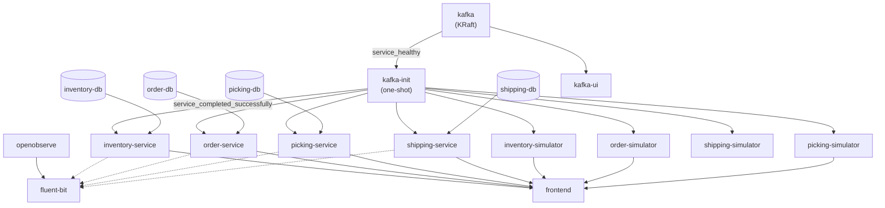

### 11.4. The `kafka-init` Initialization Container

The `kafka-init` container runs a short bootstrap script that creates all required topics with idempotent, `if-not-exists` semantics after Kafka becomes healthy. Every microservice depends on `kafka-init` completing successfully before it starts.

### 11.5. Persistence and Volumes

Mongo data survives container recreation thanks to named volumes, along with a persistent volume for OpenObserve.

To reset domain state during demos, the developer runs `npm run docker:clean:db`, which stops the stack and removes the four Mongo volumes.

### 11.6. Frontend Build

The frontend Dockerfile (frontend/Dockerfile) is the same single-stage pattern but ends with `CMD ["npm", "start"]`, which runs `next start` on the pre-built `.next` artifact.

### 11.7. Operations Cheat-Sheet

Top-level npm scripts (package.json) abstract common docker compose invocations:

| Script                              | Effect                                                                 |
|-------------------------------------|------------------------------------------------------------------------|
| `npm run docker:start`              | `docker compose up -d --build`                                         |
| `npm run docker:stop`               | `docker compose down --remove-orphans`                                 |
| `npm run docker:restart`            | stop + start                                                           |
| `npm run docker:restart:fe`         | rebuilds and replaces only the frontend container                      |
| `npm run docker:restart:<service>`  | per-service rebuild without recreating the rest of the stack           |
| `npm run docker:clean:db`           | stops the stack and deletes the four Mongo volumes                     |

These are the *only* commands a demonstrator needs to operate the system end to end.

### 11.8. Kubernetes Readiness

Although no K8s manifests are part of the current deliverable, the architecture is intentionally compatible with K8s: services are stateless (state lives in Kafka and Mongo), each service has a `health` endpoint usable as a liveness/readiness probe, configuration is environment-variable-only, and the `kafka-init` pattern naturally translates to a K8s **Job** with `initContainers` semantics.

---

## 12. Observability

Observability is a first-class architectural driver (ASR-5). The system implements the **logs** pillar fully, the **metrics** pillar partially (via health endpoints and Kafka UI), and *does not* implement **distributed tracing** — which is acknowledged in §15.

### 12.1. Logging Pipeline

The pipeline is fully declarative and routes every container’s stdout into OpenObserve via Fluent Bit.

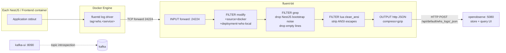

### 12.2. The `fluentd` Logging Driver

Every core service in `docker-compose.yml` is configured with the Docker `fluentd` logging driver, using the same asynchronous retry settings and a per-service tag.

This means **the application code does not call any logging library other than `console.log` / `Logger`**: the Docker engine itself ships stdout to Fluent Bit. The architecture is therefore *log-library agnostic*, and a service can be re-implemented in any language without breaking the observability contract.

### 12.3. Fluent Bit Configuration

The Fluent Bit pipeline listens for forwarded container logs, adds a couple of metadata fields, removes noisy bootstrap output, strips ANSI escape sequences, and forwards the cleaned records to OpenObserve as compressed JSON.

Three things are notable:

1. **A filtering step discards NestJS bootstrap noise** so OpenObserve only stores domain-relevant log lines.
2. **A Lua script strips ANSI escape sequences** that would otherwise pollute log records.
3. **Output is gzipped JSON** to OpenObserve’s ingest endpoint, indexed under a dedicated stream.

### 12.4. OpenObserve

OpenObserve is the analytics endpoint: it stores logs, exposes a UI on port 5080, and supports SQL-like queries. A healthcheck on `/healthz` enforces dependency ordering.

### 12.4.1. Practical Example: Tracing an Order

To demonstrate OpenObserve's query capabilities, suppose you need to trace a specific order (`1778183057229`) through the entire system from placement to dispatch. The following SQL query retrieves all related log entries ordered by timestamp:

```sql
SELECT 
  _timestamp as timestamp,
  source,
  log
FROM whs_logs
WHERE 
  log ILIKE '%ordine 1778183057229%'
ORDER BY _timestamp ASC
LIMIT 1000
```

### 12.5. Kafka UI

Provectus Kafka UI is configured as a read-only introspector so topic inspection is possible during demos without risking accidental topic deletion or message production.

### 12.6. Health Endpoints

Every core service exposes `GET /<service>/health` returning `{ status: 'ok', service: '<name>' }`. The frontend uses these as a status badge in the “Status” page. They are also the hook for any future K8s liveness probe.

### 12.7. What is *not* implemented

- **Distributed tracing** (OpenTelemetry, Jaeger). Acknowledged in §15. The current pipeline supports correlation only via `orderId` / `taskId` strings present in log records.
- **Application metrics** (Prometheus, OTel). Currently absent; Kafka UI gives a partial view of broker health and consumer-group lag.

---

## 13. Testing Strategy

Testability (ASR-4) is a primary driver, and the codebase reflects this with a clear test taxonomy. The Jest configuration is co-located in each service’s `package.json`.

### 13.1. Test Pyramid

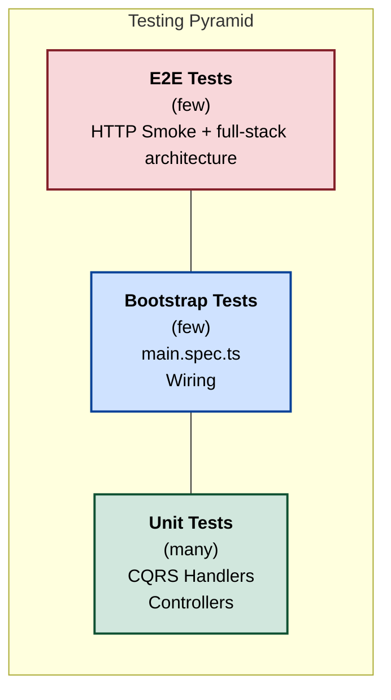

### 13.2. Unit Tests

Each service follows the canonical NestJS CQRS pattern: controller tests mock `CommandBus` and `QueryBus`; handler tests mock the specific dependencies (Kafka, Mongo model).

**Controller tests** — verify routing, parameter parsing, and dispatch to the correct Command/Query.

**Handler tests** — each `CommandHandler` is tested in isolation with its own mocked dependencies.

Unit tests cover:

- **Controllers** — REST routing, parameter parsing, CommandBus/QueryBus delegation, `@EventPattern` message filtering and dispatch.
- **Command Handlers** — state transitions, Kafka event emissions, MongoDB writes.
- **Query Handlers** — correct Mongoose `find()` calls and response shape.

### 13.3. Bootstrap Tests (`main.spec.ts`)

`main.ts` performs side effects (creating an app, starting microservices, listening) at import time. The test pattern uses module reset and a mocked Nest factory to verify bootstrap wiring, including Kafka transport and the configured port.

This validates that the Kafka transport is wired with the correct consumer group, that CORS is enabled, and that the right port is used. A second test sets `process.env.PORT='3111'` and asserts the override is respected.

### 13.4. End-to-End Tests

The codebase includes two e2e layers. Service-level e2e tests use **supertest** against a fully bootstrapped NestJS app, with the service layer mocked so the suite does not depend on Kafka or Mongo. In addition, architecture.e2e-spec.ts runs a full-stack architecture e2e scenario: it starts the Docker stack, waits for the services to become healthy, enables the simulators, and verifies cross-service behavior through the live HTTP APIs.

Together, these validate routing, Nest decorators, status codes, response shape, startup wiring, health endpoints, simulator orchestration, and a real end-to-end deployment path.

### 13.5. Coverage

Each workspace declares a Jest configuration that collects coverage from `src/**/*.(t|j)s` and writes reports under `coverage/`. The targets remain >80% for business logic and >60% for infrastructure code. 

**Current Backend Monorepo Coverage metrics:**

| Component | % Statements | % Branch | % Functions | % Lines |
|-----------|--------------|----------|-------------|---------|
| `inventory-simulator` | 100% | 78.94% | 100% | 100% |
| `order-simulator` | 96.74% | 79.24% | 100% | 96.61% |
| `picking-simulator` | 100% | 84.61% | 100% | 100% |
| `shipping-simulator` | 87.62% | 83.87% | 82.35% | 86.66% |
| `inventory-service` | 100% | 82.50% | 100% | 100% |
| `order-service` | 100% | 83.55% | 100% | 100% |
| `picking-service` | 100% | 83.78% | 100% | 100% |
| `shipping-service` | 100% | 79.80% | 100% | 100% |

*Note: the branch coverage gap (from 100%) in the core services is entirely attributable to the native JavaScript transpilations of NestJS TypeScript decorators (such as `@Inject` and `@Controller`) which contain branch logic that is untestable within a Node test runner. All business logic pathways are fully covered.*

---

## 14. Trade-offs & Alternatives Considered

### 14.1. Kafka vs RabbitMQ vs NATS

| Option        | Pros                                                                | Cons                                                | Why not chosen                                 |
|---------------|---------------------------------------------------------------------|------------------------------------------------------|------------------------------------------------|
| **Kafka**     | Durable event log, replay, partition-based scalability              | Heavier; KRaft mode still maturing                  | **Chosen.** Event log is the keystone of §4.3. |
| RabbitMQ      | Simpler to operate, good fit for AMQP work-queue use cases          | Not a log; no native replay; harder for event sourcing | Insufficient for event-sourcing posture        |

### 14.2. MongoDB vs PostgreSQL

| Option         | Pros                                                          | Cons                                                | Why not chosen                                 |
|----------------|---------------------------------------------------------------|------------------------------------------------------|------------------------------------------------|
| **MongoDB**    | Document model maps well to aggregates with embedded items   | Weaker constraints; eventual consistency mindset    | **Chosen.** Schemas in §6 are document-shaped. |
| PostgreSQL     | Strong relational integrity, transactions                    | Cross-service transactions not allowed anyway       | Overkill given no joins across contexts        |

### 14.3. Choreography vs Orchestration (Saga)

The cancellation flow could have been implemented as an **orchestrated saga** (a dedicated coordinator service driving order-cancel → release-stock → cancel-picking-task). Choreography was preferred because:

- Each service’s logic stays *local*: Inventory only cares about `OrderCancelled`, Picking only about `CancelPickingTask`.
- No new component to deploy.
- The price paid is *harder global tracing*: there is no central place to ask “what happened to order X?” — which is mitigated by the centralized log aggregation in §11.

### 14.4. CQRS — Code-Level Adoption

The initial design (prior to the refactor) kept read and write logic in a single `AppService` class per service. As the number of Kafka event handlers and REST operations grew, this class became a *god object* — violating single responsibility and making isolated testing harder.

The refactored design introduces **code-level CQRS** via `@nestjs/cqrs`:

- **Writes** → Command + CommandHandler (one handler per use-case).
- **Reads** → Query + QueryHandler.
- **Controller** → thin dispatcher; no business logic.

The CQRS split is **not infrastructural**: both read and write paths share the same MongoDB instance. There is no separate read store, materialized view, or eventual consistency between read and write sides. The benefit is purely structural:

| Benefit | Explanation |
|---------|-------------|
| **Testability** | Each handler is unit-tested in isolation with mocked Kafka, Mongo, and Gateway — without bootstrapping the entire module. |
| **Single Responsibility** | Each handler owns exactly one use-case, eliminating the god-service anti-pattern. |
| **Extensibility** | Adding a new event handler means adding two files (`command.ts` + `handler.ts`) and registering in `index.ts` — no changes to existing code. |

The trade-off is slightly more boilerplate per operation (command class + handler class vs. a single service method), which is acceptable given the pedagogical aim and the maintainability gain.

### 14.5. Single Broker, RF=1

Operating a single Kafka broker with replication factor 1 means **any broker outage causes data loss**. This is acceptable for the academic context — the system is reset between demos — but the architecture is otherwise broker-replication-ready.

### 14.6. Server-Sent Events (SSE) for UI Push

SSE was chosen over WebSocket/Socket.IO because:

- The UI push is strictly unidirectional (server to browser): Kafka events trigger data re-fetches.
- SSE is simpler to implement (native EventSource API, no library needed on the client).
- The frontend `/api/events` endpoint connects to Kafka as a consumer and streams events directly, eliminating per-service WebSocket gateways.
- No additional dependencies required.

### 14.7. Single-Stage vs Multi-Stage Dockerfiles

Single-stage was chosen for simplicity and faster iteration during development. The cost is larger images that include `devDependencies`. This is a deliberate trade-off, listed in §15 as future work.

---

## 15. Architectural Decision Records (ADRs)

### ADR-001 — Apache Kafka as the Primary Broker

- **Context.** §4.2 requires asynchronous, durable, replayable inter-service communication.
- **Decision.** Use Apache Kafka in KRaft mode. Topics are named after domain events in PascalCase. One partition per topic for the didactic deployment.
- **Consequences.** Replay is feasible (event-sourcing posture, §4.3). Operational complexity higher than a transient broker. KRaft removes ZooKeeper, limiting moving parts.

### ADR-002 — Database-per-Service (MongoDB)

- **Context.** Loose coupling driver demands schema independence per bounded context.
- **Decision.** Four separate Mongo containers, one per service, with isolated credentials and volumes.
- **Consequences.** No cross-service joins; data duplication in event payloads is accepted (e.g., `allocations` carried in events).

### ADR-003 — Choreography over Orchestration

- **Context.** Two reasonable styles for multi-service workflows.
- **Decision.** Choreography. No orchestrator service.
- **Consequences.** Pro: each service evolves independently. Con: tracing is harder; mitigated by §11 log aggregation. The cancellation flow is the most complex case and remains tractable thanks to enriched events (`previousStatus`, `allocations`).

### ADR-004 — Cancellation Flow Inversion (HTTP in, Kafka out)

- **Context.** Cancellation is initiated by an operator in the UI but must propagate to multiple services.
- **Decision.** Expose a single cancellation entry point in the Order Service. After the local state transition, emit `CancelPickingTask` and `OrderCancelled` to Kafka. Other services react asynchronously and idempotently.
- **Consequences.** UX is responsive (synchronous ACK from Order). Side effects are decoupled. Idempotency must be enforced in consumers (cf. §4.8).

### ADR-005 — `kafka-init` Initialization Container

- **Context.** Iteration 3 (§3.2) revealed `UNKNOWN_TOPIC_OR_PARTITION` errors when consumers subscribed before topics existed.
- **Decision.** Introduce a one-shot `kafka-init` container that pre-creates all 13 topics with `--if-not-exists` after Kafka’s healthcheck. All app containers depend on `kafka-init: service_completed_successfully`.
- **Consequences.** Removes the race condition. Adds one container to the topology. Idempotent across restarts. Adding a new topic now requires a one-line edit to scripts/init-kafka-topics.sh.

### ADR-006 — Fluentd Docker Logging Driver as the Log Transport

- **Context.** Observability driver requires centralized logs without burdening application code.
- **Decision.** Use Docker’s `fluentd` log driver on every core service, with a per-service `tag`. Fluent Bit terminates the connection.
- **Consequences.** Application code stays log-library-agnostic. A Fluent Bit outage does not block applications (driver is `async` with retries).

### ADR-007 — Simulators as External Drivers

- **Context.** Simulability driver requires unattended end-to-end execution.
- **Decision.** Build four separate simulator services that drive the system exclusively through their public REST contracts, not through internal hooks.
- **Consequences.** Simulators can be replaced or scaled independently. Core services remain free of demo-specific code paths.

### ADR-008 — Server-Sent Events (SSE) over WebSocket/Socket.IO

- **Context.** The original real-time push mechanism used **Socket.IO** (`@nestjs/websockets` + `@nestjs/platform-socket.io` on the backend, `socket.io-client` on the frontend). Each core microservice exposed its own WebSocket gateway, and the frontend opened four independent Socket.IO connections — one per service — to receive domain events. This introduced several pain points: (1) **four extra dependencies** (`@nestjs/websockets`, `@nestjs/platform-socket.io`, `socket.io`, `socket.io-client`) across the stack; (2) **per-service gateway boilerplate** duplicated in every microservice; (3) the frontend needed to manage multiple persistent connections with independent reconnection logic; (4) Socket.IO's bidirectional capabilities were unused — the UI only *received* events, never *sent* them through the socket.
- **Decision.** Replace all Socket.IO gateways with a single **Server-Sent Events (SSE)** endpoint at `/api/events` in the Next.js frontend. This endpoint connects to Kafka as a consumer (subscribing to all 13 domain topics), and streams each event to the browser as an SSE message. On the client side, the native `EventSource` API replaces `socket.io-client`, wrapped in a custom `useRealtimeSSE(topics, fetchFn)` React hook that filters events by topic and triggers data re-fetches.
- **Consequences.**
  - **Dependency reduction:** removed `@nestjs/websockets`, `@nestjs/platform-socket.io`, `socket.io`, and `socket.io-client` from the entire codebase — four fewer runtime dependencies to maintain and audit.
  - **Simplified topology:** real-time push is consolidated in a single endpoint (`/api/events`) rather than scattered across four WebSocket gateways. The core microservices no longer carry any real-time push responsibility; they only produce Kafka events.
  - **Native browser API:** `EventSource` is built into every modern browser, requires no polyfill, and handles reconnection automatically with exponential backoff.
  - **Unidirectional by design:** SSE enforces the server→client direction, which matches the actual data flow (Kafka events → UI refresh). The bidirectional overhead of WebSocket/Socket.IO was unnecessary.
  - **Trade-off — no client→server push:** if a future feature requires client-initiated real-time messages (e.g., collaborative editing, cursor sharing), SSE alone would be insufficient and WebSocket would need to be reintroduced for that specific use-case. This is acceptable given the current unidirectional requirement.

### ADR-009 — Code-Level CQRS via `@nestjs/cqrs`

- **Context.** The initial monolithic `AppService` per microservice mixed Kafka event handling, REST business logic, and read queries in a single class, growing into a god-object that hindered testability and readability.
- **Decision.** Adopt `@nestjs/cqrs` module. Decompose each service into Commands (write operations) and Queries (read operations), each with a dedicated handler class. The controller becomes a thin dispatcher using `CommandBus` and `QueryBus`. Both paths share the same MongoDB — no infrastructural read/write store separation.
- **Consequences.** Handlers are independently testable (mock only their direct dependencies). Adding a new event listener is a two-file operation (`command.ts` + `handler.ts`). Slightly more boilerplate per use-case, but the canonical file structure (§4.4, Appendix C) makes it predictable. The `CqrsModule` import is required in every `app.module.ts`.

---

## 16. Known Limitations & Future Work

Each item is paired with an attribute it would improve.

| # | Limitation                                                                  | Improves                       | Suggested resolution                                              |
|---|------------------------------------------------------------------------------|--------------------------------|-------------------------------------------------------------------|
| 1 | Single Kafka broker, RF=1                                                    | Resilience                     | 3-broker cluster with RF=3, `min.insync.replicas=2`               |
| 2 | No distributed tracing                                                       | Observability                  | OpenTelemetry SDK in each service, OTLP → OpenObserve / Tempo     |
| 3 | No application metrics (Prometheus)                                          | Observability                  | Add `prom-client`, scrape via Prometheus, Grafana dashboards      |
| 4 | No authentication / authorization                                            | Security                       | Service-to-service mTLS or JWT; UI with OAuth2/OIDC               |
| 5 | No schema registry; events are loose JSON                                    | Modifiability                  | Confluent Schema Registry + Avro/Protobuf                         |
| 6 | No dead-letter topic for poison messages                                     | Resilience                     | Add `<topic>.DLT` topics + retry/backoff policies                  |
| 7 | Single-stage Dockerfiles                                                     | Deployability, image size      | Multi-stage builds with `node:alpine` runtime + `dist/` only      |
| 8 | No K8s manifests                                                             | Deployability                  | Helm chart, k8s `Job` for `kafka-init`                            |
| 9 | No real Kafka/Mongo integration tests                                        | Testability                    | Testcontainers integration suite                                  |
|10 | Hard-coded development credentials (Mongo `root:example`, OpenObserve)       | Security                       | Docker secrets / env-driven secret injection                      |
|11 | Cancellation idempotency relies on local state checks, not on event idempotency keys | Resilience                | Add a deduplication store keyed by `eventId`                      |
|12 | UI SSE re-fetches entire dataset on every event, no granular updates         | Performance                | Send partial payloads via SSE to enable incremental UI updates    |
|13 | `inventory-service` exposes inbound HTTP                                   | Pattern purity                 | Make inbound a Kafka-only entry point; the HTTP route was a holdover from early iterations |

---

## 17. Conclusions & Lessons Learned

WHS represents a deliberate and measurable architectural evolution over the project from which it originated. The prior system covered only the **picking sub-domain** across **two microservices**, used a **message-driven** (not event-sourced) communication model, and shared a **single database** between its components. Each of those choices — narrow domain scope, transient messaging, shared persistence — was a concrete pain point that motivated the rework. The results confirm that the investment was worthwhile.

### 17.1. What the Rework Improved

**Domain coverage.** The original two-service scope (picking service + picking handler) made it impossible to exercise inter-domain flows such as inventory allocation, order suspension, or cancellation propagation. WHS expands to four bounded-context-aligned services covering the full warehouse lifecycle — inbound, inventory, orders, picking, and shipping — making these flows first-class, demonstrable scenarios rather than out-of-scope future work.

**Loose coupling and failure isolation.** The original message-driven design coupled the picking handler tightly to the picking service: a failure in one stalled the other. By replacing direct message passing with a **durable Kafka event log** and **choreography-based coordination**, WHS achieves true failure isolation: each service can crash and recover independently, consuming missed events on restart, with no data loss and no synchronous dependency on any peer.

**Scalability via database-per-service.** The shared database of the original project was both a coupling point and a scaling bottleneck — any schema change or load spike on one component affected the other. The **database-per-service** pattern (ADR-002) eliminates both problems: each service owns its read model, evolves its schema independently, and can be scaled without interference.

**Testability.** The original codebase concentrated logic in a small number of large components, making isolated unit testing difficult. The **code-level CQRS** refactoring (ADR-009) decomposed these into focused, single-responsibility handlers, each testable with a handful of mocked dependencies and no framework bootstrapping overhead. The result is a four-layer test pyramid (unit → bootstrap → gateway → e2e) across every service, compared to the minimal test coverage of the prior project.

**Observability.** The original system had no centralized log aggregation. WHS introduces a full declarative logging pipeline — Docker `fluentd` driver → Fluent Bit → OpenObserve — that aggregates structured logs from every container without modifying a single line of application code. The `fluentd` logging driver (ADR-006) acts as an architectural seam: once in place, the pipeline is language- and framework-agnostic.

### 17.2. Lessons Learned

1. **Startup ordering is part of the architecture.** The race condition that motivated the `kafka-init` container (ADR-005) is not a bug — it is a property of any system that subscribes to topics that may not yet exist. Treating initialization as an explicit pattern (using Docker Compose's `service_completed_successfully` condition) avoided the temptation of `sleep` hacks and produced a fully declarative startup contract.

2. **Choreography pays back the moment you cancel.** The cancellation flow could easily have grown into a multi-call synchronous monster. By inverting it into an HTTP entry point followed by Kafka fan-out (ADR-004), each service's code remained small and locally reasoned. The cost — global tracing — was repaid by the centralized log aggregation in §11.

3. **Observability does not have to be expensive.** A 50-line `fluent-bit.conf` and a single OpenObserve container were enough to satisfy ASR-5 in full for the logs pillar. The architectural lever was the `fluentd` Docker logging driver (ADR-006): once that contract was in place, application code remained log-library agnostic and could focus on domain logic.

4. **Code-level CQRS eliminates god-services early.** Introducing `@nestjs/cqrs` (ADR-009) decomposed what were growing `AppService` monoliths into focused, single-responsibility handlers. The thin-controller pattern makes the system more navigable: a developer reading `app.controller.ts` sees the full routing table, and each handler file is self-contained. The additional boilerplate (command class + handler class per operation) is offset by dramatically simpler unit tests, since each handler is instantiated with only its own dependencies.

5. **The frontend as API Gateway makes deployment topology-agnostic.** The original architecture hardcoded `localhost:300x` URLs in the frontend client code, coupling the UI to a specific deployment topology and making production deployment impossible without code changes. By moving to server-side Next.js rewrites with environment-variable-driven backend URLs, the same frontend build now works unchanged across local development (`localhost`), Docker Compose (`http://inventory-service:3001`), and Kubernetes (`http://inventory-service.whs.svc.cluster.local:3001`). The single exposed port (3000) also simplifies reverse-proxy and load-balancer configuration in production.

### 17.3. Looking Ahead

In its current form WHS is a complete, demonstrable, didactically valuable system. The gap between the original two-service project and this rework is not merely quantitative (more services, more tests, more infrastructure) but qualitative: the architecture now supports independent evolvability, fault containment, and operational introspection — qualities that the original design structurally precluded. The limitations in §15 mark the next gap to close.

---
## Appendix A — Glossary of Domain Events

All 14 events are JSON. Producer and consumer columns are defined in §8.1.

| Event                    | Payload (TypeScript-style)                                                                    |
|--------------------------|------------------------------------------------------------------------------------------------|
| `OrderPlaced`            | `{ orderId: string, items: { productId: string, quantity: number }[] }`                       |
| `OrderCancelled`         | `{ orderId: string, previousStatus: OrderStatus, allocations: Allocation[] }`                  |
| `OrderReadyForPicking`   | `{ orderId: string, allocations: Allocation[] }`                                              |
| `OrderSuspended`         | `{ orderId: string }`                                                                          |
| `CancelPickingTask`      | `{ orderId: string }`                                                                          |
| `InventoryAllocated`     | `{ orderId: string, allocations: { productId: string, quantity: number, location: string }[] }` |
| `OutOfStock`             | `{ orderId: string }`                                                                          |
| `ItemStored`             | `{ productId: string, location: string, addedQuantity: number, totalQuantity: number }`       |
| `PickingTaskCreated`     | `{ taskId: string, orderId: string, allocations: Allocation[] }`                              |
| `PickingTaskCompleted`   | `{ taskId: string, orderId: string, allocations: Allocation[] }`                              |
| `ShipmentAssigned`       | `{ taskId: string, orderId: string, vehicleId: string }`                                      |
| `VehicleDispatched`      | `{ vehicleId: string, tasks: TaskRef[] }`                                                     |
| `VehicleRegistered`      | `{ vehicleId: string, maxCapacity: number }`                                                  |

`Allocation = { productId: string, quantity: number, location: string }`

`OrderStatus = 'PENDING' | 'SUSPENDED' | 'ALLOCATED' | 'PICKING_COMPLETED' | 'SHIPPED' | 'CANCELLED'`

---
